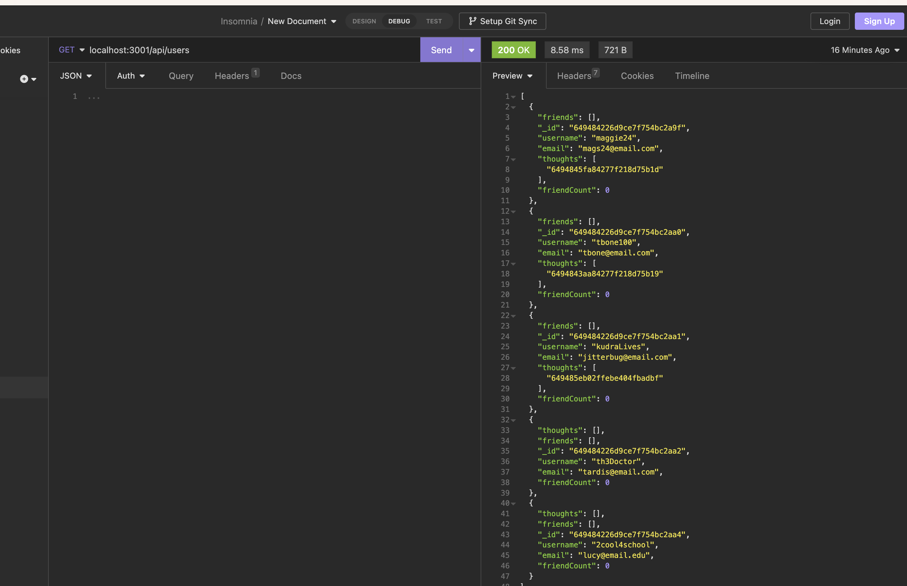
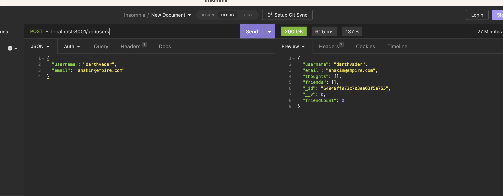
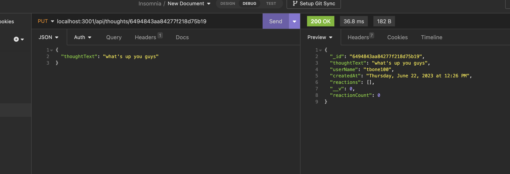

# social-network-api
  -------------------
  ## Badges
  -------------------
    
  ## Table of Contents  
  ----------------------
  - [Description](#description) 
  - [Usage](#usage)  
  - [Installation](#installation)   
  - [Contributing](#contributing)  
  - [Questions](#questions)
  - [License](#license)
    

  ## Description  
  -------------------
  This application is a backend app for a social media app. 

  screenshots of the various routes:

  

  

  

  ## Usage  
  ------------
  Once you have started the server you can use Insomnia to test the various routes. There are two main models (created in mongoDB) that you can run routes on. Users and thoughts. For the user routes there are create new, update user, delete user, add friend, get all users and get user by id.  For the thought routes there are create thought update thought, create reaction, delete reaction, get all thoughts, get one thought and delete thought.

  You can view a video walkthrough here: [Walkthrough](https://drive.google.com/file/d/1suqAZMDoyZfTBLWz5MR9T0xFlW4X-1wU/view?usp=sharing)
  ## Installation  
  -------------------
  Clone github repository to your local machine and run `npm i` to install dependencies. Use `npm run seed` to generate a list of users and `npm start` to begin the server. Use Insomnia (or similar) and navigate to localhost:3001/api/users to see a list of prepopulated users.

  ## Credits 
  ------------------
  I consulted the documentation for the NPM [Mongoose](https://mongoosejs.com/docs/index.html) package and [stack overflow](https://stackoverflow.com/).

  ## Tests
  ------------------
  Use insomnia to run the routes. Results are returned as JSON objects. You can do GET, POST, PUT and DELETE queries using api routes `/users` and `/thoughts`.

  ## Contact Information
  -------------------------
  ### Github: [Phillip Pfister](https://github.com/Phil-Pfister)
  ### Email: salshouse@gmail.com

  
  ## License 
-------------- 
This application uses the The Unlicense license
  

